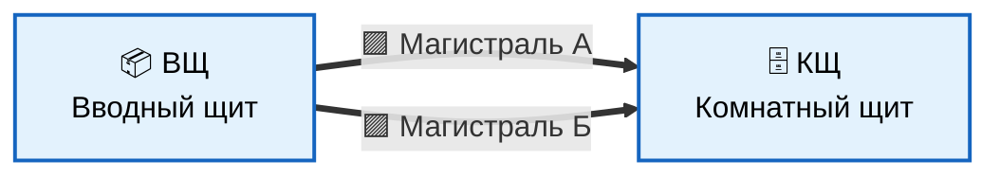
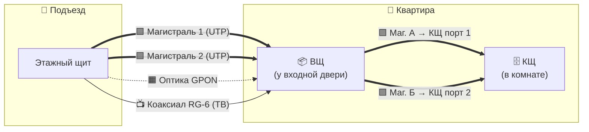

# Схема слаботочной сети квартиры (ВЩ + КЩ)

## 🏗️ Архитектура системы

В квартире устанавливаются **два слаботочных щита**, соединённых между собой двумя магистральными кабелями:

| Сокращение | Полное название              | Расположение           |
|:----------:|:-----------------------------|:-----------------------|
| **ВЩ**     | Вводный щит                  | У входной двери        |
| **КЩ**     | Комнатный слаботочный щит    | В комнате (на стене)   |

---

## 📦 ВЩ — Вводный щит (у входной двери)

### Назначение
- Точка ввода всех внешних линий в квартиру (Ethernet, оптика, ТВ-антенна)
- Размещение оптического терминала (ONT) Ростелеком
- Размещение **антенного ТВ-сплиттера** (1 вход → 3 выхода)
- Коммутация магистралей подъезда с магистралями в КЩ

### Состав

| № | Компонент                                      | Кол-во |
|---|------------------------------------------------|:------:|
| 1 | Настенный бокс компактный (белый)              | 1 шт.  |
| 2 | Патч-панель **6 портов RJ-45**                 | 1 шт.  |
| 3 | Место под **ONT Ростелеком (GPON)**            | 1 шт.  |
| 4 | **Антенный сплиттер ТВ (1 вход / 3 выхода)**   | 1 шт.  |
| 5 | Розетка 220 В для питания ONT                  | 1 шт.  |

### Распределение портов ВЩ (патч-панель)

| № порта | Назначение                              | Цвет          |
|:-------:|:----------------------------------------|:--------------|
| **1**   | Магистраль подъезда №1 (вход)           | 🟪 Фиолетовый |
| **2**   | Магистраль подъезда №2 (вход)           | 🟪 Фиолетовый |
| **3**   | Магистраль А → КЩ                       | 🟪 Фиолетовый |
| **4**   | Магистраль Б → КЩ                       | 🟪 Фиолетовый |
| **5**   | LAN от ONT Ростелеком                   | 🟫 Коричневый |
| **6**   | Резерв                                  | ── Без цвета  |

### Распределение выходов антенного сплиттера

| Выход | Назначение            | Тип кабеля        |
|:-----:|:----------------------|:------------------|
| Вход  | От подъездного щита   | Коаксиал RG-6     |
| 1     | Комната 1 (ТВ-розетка)| Коаксиал RG-6     |
| 2     | Комната 2 (ТВ-розетка)| Коаксиал RG-6     |
| 3     | Кухня (ТВ-розетка)    | Коаксиал RG-6     |

```
┌──────────────────────────────────┐
│   ВЩ — Вводный щит               │
│   (у входной двери)              │
│                                  │
│  ┌────────────────────────────┐  │
│  │  Патч-панель 6 портов      │  │
│  │  ┌──┬──┬──┬──┬──┬──┐       │  │
│  │  │1 │2 │3 │4 │5 │6 │       │  │
│  │  │🟪│🟪│🟪│🟪│🟫 │       │  │
│  │  └──┴──┴──┴──┴──┴──┘       │  │
│  └────────────────────────────┘  │
│                                  │
│  ┌────────────────────────────┐  │
│  │  📡 ONT Ростелеком (GPON)  │  │
│  └────────────────────────────┘  │
│                                  │
│  ┌────────────────────────────┐  │
│  │  📺 Антенный сплиттер ТВ   │  │
│  │  ── 1 вход / 3 выхода ──   │  │
│  │  IN ◀── от подъезда       │  │
│  │  OUT1 ──► Комната 1        │  │
│  │  OUT2 ──► Комната 2        │  │
│  │  OUT3 ──► Кухня            │  │
│  └────────────────────────────┘  │
│                                  │
│  ◉ Розетка 220В                  │
└──────────────────────────────────┘
```

---

## 🗄️ КЩ — Комнатный слаботочный щит

### Состав

| №  | Компонент                                       | Кол-во | U  |
|----|-------------------------------------------------|:------:|:--:|
| 1  | Настенный бокс 8U (белый)                       | 1 шт.  | —  |
| 2  | Патч-панель 8 портов RJ-45 (№1)                 | 1 шт.  | 1U |
| 3  | Патч-панель 8 портов RJ-45 (№2)                 | 1 шт.  | 1U |
| 4  | Кабель-органайзер                               | 1 шт.  | 1U |
| 5  | Коммутатор 8 портов                             | 1 шт.  | 4U |
| 6  | PDU 220 В                                       | 1 шт.  | —  |

### Распределение портов КЩ

#### 🔹 Патч-панель №1 (порты 1–8) — магистрали + серверная + Wi-Fi

| № | Назначение                       | Цвет          |
|:-:|:---------------------------------|:--------------|
| **1** | **Магистраль А (от ВЩ)**     | 🟪 Фиолетовый |
| **2** | **Магистраль Б (от ВЩ)**     | 🟪 Фиолетовый |
| 3 | Серверная (порт 1)               | 🟥 Красный    |
| 4 | Серверная (порт 2)               | 🟥 Красный    |
| 5 | Серверная (порт 3)               | 🟥 Красный    |
| 6 | Серверная (порт 4)               | 🟥 Красный    |
| 7 | **Wi-Fi (1 точка)**              | 🟨 Жёлтый     |
| 8 | **Wi-Fi (1 точка)**              | 🟨 Жёлтый     |

#### 🔹 Патч-панель №2 (порты 9–16) — комнаты + ТВ

| №  | Назначение            | Цвет           |
|:--:|:----------------------|:---------------|
| 9  | Комната 1             | 🟦 Синий       |
| 10 | Комната 2             | 🟩 Зелёный     |
| 11 | Телевизор (порт 1)    | ⬛ Чёрный      |
| 12 | Телевизор (порт 2)    | ⬛ Чёрный      |
| 13 | Телевизор (порт 3)    | ⬛ Чёрный      |
| 14 | Резерв                | ── Без цвета   |
| 15 | Резерв                | ── Без цвета   |
| 16 | Резерв                | ── Без цвета   |

```
┌──────────────────────────────────────────────────────────────────┐
│  ◉                  КЩ — Комнатный щит                        ◉ │
│                      (белый)                                     │
│                                                                  │
│  ┌────────────────────────────────────────────────────────────┐  │
#  │                    ПАТЧ-ПАНЕЛЬ №1 (1–8)                    │  │
│  │  ┌────┬────┬────┬────┬────┬────┬────┬────┐                 │  │
│  │  │ 1  │ 2  │ 3  │ 4  │ 5  │ 6  │ 7  │ 8  │                 │  │
│  │  │🟪   🟪 │ 🟥  🟥   🟥  🟥 │🟨   🟨                   │  │
│  │  │МагА│МагБ│Серв│Серв│Серв│Серв│WiFi│WiFi│                 │  │
│  │  └────┴────┴────┴────┴────┴────┴────┴────┘                 │  │
│  └────────────────────────────────────────────────────────────┘  │
│                                                                  │
│  ┌────────────────────────────────────────────────────────────┐  │
#  │  │                ПАТЧ-ПАНЕЛЬ №2 (9–16)                    │  │
│  │  ┌────┬────┬────┬────┬────┬────┬────┬────┐                 │  │
│  │  │ 9  │ 10 │ 11 │ 12 │ 13 │ 14 │ 15 │ 16 │                 │  │
│  │  │🟦  │🟩  │⬛ │⬛ │⬛  │    │    │   │               
│  │  │К1  │К2  │ТВ  │ТВ  │ТВ  │Рез │Рез │Рез │                 │  │
│  │  └────┴────┴────┴────┴────┴────┴────┴────┘                 │  │
│  └────────────────────────────────────────────────────────────┘  │
│                                                                  │
│  ┌────────────────────────────────────────────────────────────┐  │
#  │                  КАБЕЛЬ-ОРГАНАЙЗЕР 1U                      │  │
│  └────────────────────────────────────────────────────────────┘  │
│                                                                  │
│  ┌────────────────────────────────────────────────────────────┐  │
│  │   КОММУТАТОР 8 портов     ▣▣▣▣ ▣▣▣▣                    │  │
│  └────────────────────────────────────────────────────────────┘  │
│                                                                  │
│  ◉ Розетка 220В                                                  │
└──────────────────────────────────────────────────────────────────┘
```

---

## 📐 Физическое размещение оборудования в комнате

```
   ┌─────────────────── Подвесной потолок ───────────────────┐
   │                                                         │
   │            ↕ 15 см                                      │
   │         ┌─────────┐                                     │
   │         │ 🟨 🟨  │  ← Wi-Fi розетки (порт 7, порт 8)   │
   │         └─────────┘              над КЩ                 │
   │                                                         │
   │                                                         │
   │   ┌─────────────────────────────────┐                   │
   │   │                                 │                   │
   #   │       🗄️ КЩ                     │                   │
   │   │   Комнатный слаботочный щит     │                   │
   │   │                                 │                   │
   │   │   • Патч-панель №1 (1–8)        │                   │
   │   │   • Патч-панель №2 (9–16)       │                   │
   │   │   • Коммутатор 8 портов         │                   │
   │   │   • Розетка 220В                │                   │
   │   │                                 │                   │
   │   └─────────────────────────────────┘                   │
   │                                                         │
   │   ┌───┐ ┌───┐ ┌───┐ ┌───┐                               │
   │   │🟥│ │🟥 │ │🟥 ││🟥 │  ← Серверные розетки          │
   │   │   │ │   │ │   │ │   │     (порты 3–6)               │
   │   └───┘ └───┘ └───┘ └───┘     прямо под КЩ              │
   │            ↕ 10 см                                      │
   │                                                         │
   └────────────────── Плинтус / пол ────────────────────────┘
```

### Параметры размещения

| Элемент              | Кол-во | Расположение                           | Высота                          |
|----------------------|:------:|----------------------------------------|---------------------------------|
| КЩ (щит)             | 1      | На стене комнаты                       | По центру стены                 |
| Wi-Fi розетка        | **1**  | **Над КЩ**                             | **15 см от подвесного потолка** |
| Серверные розетки    | 4      | **Под КЩ**, в один ряд                 | **10 см от плинтуса**           |

---

## 🔗 Общая схема двух щитов (в квартире)



---

## 🔗 Физическая прокладка магистралей (квартира + подъезд)




---

## 🎨 Легенда цветов

```
🟦 Синий        — Комната 1 (Ethernet)
🟩 Зелёный      — Комната 2 (Ethernet)
🟥 Красный      — Серверная (4 розетки под КЩ)
🟨 Жёлтый       — Wi-Fi точка (2 розетки над КЩ)
🟪 Фиолетовый   — Магистральные линии (ВЩ ↔ КЩ)
⬛ Чёрный       — Телевизор (Ethernet, 3 порта)
🟫 Коричневый   — Линия от ONT Ростелеком
🟧 Оранжевый    — Оптоволокно GPON (внешнее)
📺 ТВ           — Коаксиальный кабель RG-6
```

---

## 📋 Кабельный журнал

| № | Линия              | Откуда                   | Куда                      | Тип кабеля      |
|---|--------------------|--------------------------|---------------------------|-----------------|
| 1 | Магистраль 1       | Этажный щит подъезда     | ВЩ, порт 1                | UTP cat.5e (экр.) |
| 2 | Магистраль 2       | Этажный щит подъезда     | ВЩ, порт 2                | UTP cat.5e (экр.) |
| 3 | Оптика GPON        | Этажный щит подъезда     | ONT в ВЩ                  | Оптоволокно     |
| 4 | **ТВ-стояк**       | **Этажный щит подъезда** | **Сплиттер в ВЩ (вход)**  | **Коаксиал RG-6** |
| 5 | LAN ONT            | ONT (LAN-выход)          | ВЩ, порт 5                | UTP cat.5e      |
| 6 | **Магистраль А**   | ВЩ, порт 3               | **КЩ, порт 1**            | UTP cat.5e (экр.) |
| 7 | **Магистраль Б**   | ВЩ, порт 4               | **КЩ, порт 2**            | UTP cat.5e (экр.) |
| 8 | ТВ-1               | Сплиттер ВЩ, выход 1     | ТВ-розетка Комната 1      | Коаксиал RG-6   |
| 9 | ТВ-2               | Сплиттер ВЩ, выход 2     | ТВ-розетка Комната 2      | Коаксиал RG-6   |
| 10| ТВ-3               | Сплиттер ВЩ, выход 3     | ТВ-розетка Кухня          | Коаксиал RG-6   |

---

## ⚙️ Принцип работы

1. **Оптика Ростелеком** заводится в **ВЩ**, подключается к **ONT**.
2. **ONT** выдаёт интернет через LAN-порт → коммутируется в патч-панель ВЩ (порт 5).
3. С помощью патч-кордов сигнал перебрасывается на **магистраль А или Б** (порты 3, 4 ВЩ).
4. Магистральные кабели идут через стены/кабель-каналы в **КЩ**, в **порты 1 и 2** (зарезервированные именно под магистрали).
5. В КЩ магистрали с порта 1 (или 2) патч-кордом подключаются к **коммутатору 8 портов**.
6. Коммутатор раздаёт интернет на порты 3–7 (серверная, Wi-Fi) и патч-панель №2 (порты 9–13: комнаты, ТВ).
7. **Серверные розетки (порты 3–6)** установлены прямо **под КЩ на высоте 10 см от плинтуса** — для удобства подключения NAS, сервера, мини-ПК и т.п.
8. **Wi-Fi розетка (порт 7)** установлена **над КЩ на расстоянии 15 см от подвесного потолка** — для оптимального покрытия беспроводной сети.
9. **ТВ-сигнал** от подъездного стояка приходит коаксиальным кабелем в **ВЩ**, где через **антенный сплиттер (1→3)** распределяется на ТВ-розетки в **Комнате 1, Комнате 2 и на Кухне**.
10. **Магистрали подъезда (порты 1, 2 ВЩ)** служат резервными каналами связи.

---

> 📌 **Версия документа:** 6.0  
> 📌 **Состав системы:** ВЩ (Вводный щит) + КЩ (Комнатный слаботочный щит)  
> 📌 **Связь между щитами:** 2 магистральных кабеля UTP cat.5e экранированный  
> 📌 **Магистрали в КЩ:** строго на портах 1 и 2 патч-панели №1  
> 📌 **ТВ:** антенный сплиттер 1→3 в ВЩ, разводка коаксиалом RG-6 на 2 комнаты + кухню  
> 📌 **Wi-Fi:** 1 точка доступа над КЩ
