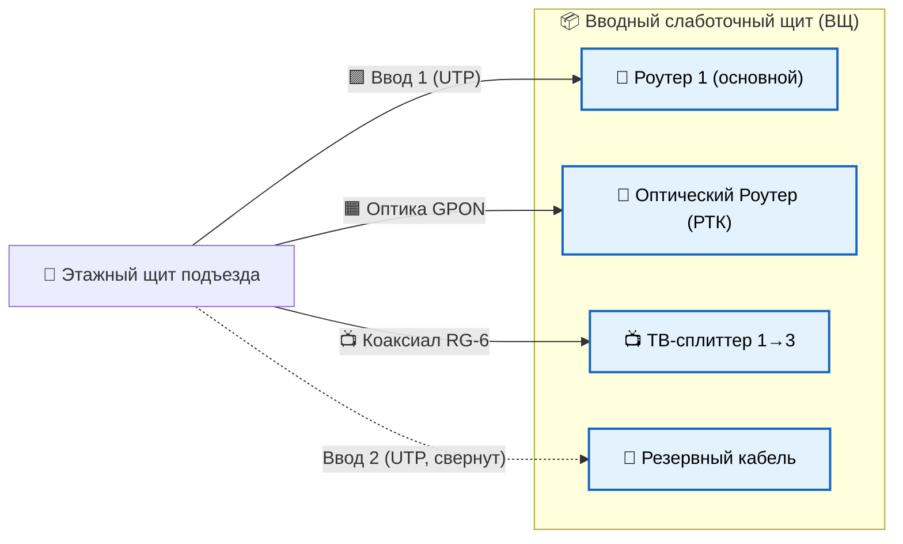
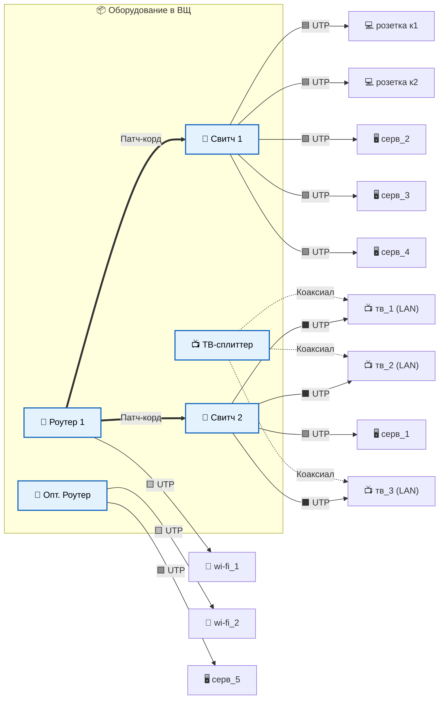

# Схема слаботочной сети квартиры (единый ВЩ)

## 🏗️ Архитектура системы

В квартире установлен **один слаботочный щит** — Вводный щит (ВЩ). В него заведены линии от провайдеров (два кабеля Ethernet Cat.5e экранированная, одна оптика GPON и антенный(коаксиал)). Все квартирные линии обжаты и подключаются напрямую в порты активного оборудования (роутеры и коммутаторы) **без использования патч-панели**. Для внутренней разводки использовать **Ethernet Cat.5e**, два кабеля к `wi_fi_1` и `wi_fi_2` -  **Ethernet Cat.5e экранированная**.

Сеть логически и физически разделена на две независимые части:
1. Основная домашняя сеть (от Роутера 1).
2. Выделенная сеть провайдера Ростелеком (от Оптического роутера).

---

## 📦 ВЩ — Слаботочный щит (единый)

### Состав оборудования

| №  | Компонент                                              | Кол-во |
|----|--------------------------------------------------------|:------:|
| 1  | **Слаботочный щит встроенный, под силовым** (на 72 модуля)            | 1 шт.  |
| 2  | Роутер 1 (основной)                                    | 1 шт.  |
| 3  | Оптический роутер (ONT Ростелеком)                     | 1 шт.  |
| 4  | Свитч 1 (8 портов, гигабитный)                         | 1 шт.  |
| 5  | Свитч 2 (8 портов, гигабитный)                         | 1 шт.  |
| 6  | Антенный ТВ-сплиттер 1→3 (коаксиал)                    | 1 шт.  |
| 7  | Блок розеток 220 В на DIN-рейку (4 розетки)            | 1 шт.  |

---

### 📐 Габариты щита

Слаботочный щит подбирается по количеству DIN-модулей и глубине под укладку UTP-кабелей. 
**Расчёт места:**

| Оборудование             | Эквивалент в DIN-модулях | Способ установки           |
|--------------------------|:------------------------:|----------------------------|
| Оптический роутер (РТК)  | ≈ 8–10 модулей          | На полке/площадке щита     |
| Роутер 1 (основной)      | ≈ 8–10 модулей          | На полке/площадке щита     |
| Свитч 1 (8 портов)       | ≈ 6–8 модулей           | На DIN-рейке или на полке  |
| Свитч 2 (8 портов)       | ≈ 6–8 модулей           | На DIN-рейке или на полке  |
| ТВ-сплиттер 1→3          | ≈ 2 модуля              | На стенке щита             |
| Розетки 220 В (PDU)      | 4–6 модулей             | На DIN-рейке               |
| Запас (укладка 12+ UTP)  | ≈ 12 модулей            | —                          |
| **Итого**                | **~ 60 модулей**     | **3 ряда DIN-рейки**       |

**Рекомендуемый щит:**

| Параметр       | Значение                                                          |
|----------------|-------------------------------------------------------------------|
| Тип            | Встроенный слаботочный (мультимедийный) щит, металлический или пластиковый |
| Кол-во модулей |  **72 модуля** (4 ряда × 18)       |
| Габариты (Ш×В) | ≈  **440 × 540 мм** (для 72 мод.) |
| Глубина        | **120–150 мм** (важно для укладки UTP — больше, чем у электрощитов) |
| Производители РФ | IEK ЩРН, ABB Mistral 41W, Schneider Resi9, EKF PROxima, Hager Volta |
| Степень защиты | IP30–IP40                                                         |

> 💡 Для слаботочки всегда выбирают щиты **с увеличенной глубиной 120+ мм** (вместо стандартных 90 мм для электрики) — 12 отходящих UTP-кабелей образуют толстый жгут и плохо переносят малые радиусы изгиба.

---

## 🗂 Компоновка щита (вид изнутри)


```text
┌──────────────────────────────────────────────────────────────────┐
│  ВЩ — Слаботочный щит встроенный (72 модуля, глубина 130 мм)     │
├──────────────────────────────────────────────────────────────────┤
│                                                                  │
│  ▸ Ввод кабелей сверху: оптика GPON, 2× UTP магистрали           │
│    (одна активная, вторая в резерве), ТВ-коаксиал, питание 220В  │
│                                                                  │
│  ┌────────────────────────────────────────────────────────────┐  │
│  │ РЯД 1 (DIN-рейка)                                          │  │
│  │  ◉◉◉◉◉◉  PDU 220В (4 розетки)    │  📺 ТВ-сплиттер 1→3 │  │
│  └────────────────────────────────────────────────────────────┘  │
│                                                                  │
│  ┌────────────────────────────────────────────────────────────┐  │
│  │ РЯД 2 — ПОЛКА                                              │  │
│  │   📡 Оптический роутер (Ростелеком)                        │  │
│  └────────────────────────────────────────────────────────────┘  │
│                                                                  │
│  ┌────────────────────────────────────────────────────────────┐  │
│  │ РЯД 3 — ПОЛКА                                              │  │
│  │   📶 Роутер 1 (основной)      │   (свободное место / охл.) │  │
│  └────────────────────────────────────────────────────────────┘  │
│                                                                  │
│  ┌────────────────────────────────────────────────────────────┐  │
│  │ РЯД 4 — DIN-рейка / полка (при наличии 4-го ряда)          │  │
│  │  🔀 Свитч 1 (8 портов)       │ 🔀 Свитч 2 (8 портов)      │  │
│  │   ▣▣▣▣ ▣▣▣▣                  │  ▣▣▣▣ ▣▣▣▣          │  │
│  └────────────────────────────────────────────────────────────┘  │
│                                                                  │
│  ▸ Вывод кабелей снизу: 12× UTP-линий (2 розетки, 5 серверов,    │
│    3 LAN-ТВ, 2 Wi-Fi ) и 3× ТВ-коаксиала                         │
│                                                                  │
└──────────────────────────────────────────────────────────────────┘
```

### Распределение портов оборудования

#### 🔹 Роутер 1 (основной) — 1 WAN + 4 LAN
| Порт      | Назначение                                | 
|:---------:|:------------------------------------------|
| **WAN**   | **Ввод 1** (Основной провайдер)           | 
| **LAN 1** | Патч-корд → **Свитч 1** (Uplink, порт 1)  | 
| **LAN 2** | Патч-корд → **Свитч 2** (Uplink, порт 1)  | 
| **LAN 3** | Прямая линия → **wi-fi_1**                | 
| **LAN 4** | Резерв                                    | 

#### 🔹 Свитч 1 (8 портов) — Компьютеры и серверы
| Порт | Назначение                                 | Статус |
|:----:|:-------------------------------------------|:-------|
| 1    | Uplink ← Роутер 1 (LAN 1)                  | Занят  |
| 2    | Компьютерная розетка **к1**                | Занят  |
| 3    | Компьютерная розетка **к2**                | Занят  |
| 4    | Сервер **серв_2(хранилище)**               | Занят  |
| 5    | Сервер **серв_3(основной)**                | Занят  |
| 6    | Сервер **серв_4(резерв)**                  | Занят  |
| 7    | Резерв                                     | Свободен|
| 8    | Резерв                                     | Свободен|

#### 🔹 Свитч 2 (8 портов) — ТВ и доп. оборудование
| Порт | Назначение                                 | Статус |
|:----:|:-------------------------------------------|:-------|
| 1    | Uplink ← Роутер 1 (LAN 2)                  | Занят  |
| 2    | LAN-розетка **тв_1**                       | Занят  |
| 3    | LAN-розетка **тв_2**                       | Занят  |
| 4    | LAN-розетка **тв_3**                       | Занят  |
| 5    | Устройство **серв_1(принтер)**             | Занят  |
| 6    | Резерв                                     | Свободен|
| 7    | Резерв                                     | Свободен|
| 8    | Резерв                                     | Свободен|

#### 🔹 Оптический роутер (Ростелеком)
| Порт      | Назначение                                | 
|:---------:|:------------------------------------------|
| **WAN/Opt**| Оптика из подъезда (GPON)                 |
| **LAN 1** | Прямая линия → **wi-fi_2**                |
| **LAN 2** | Прямая линия → **серв_5**                 |

---

## 🔗 Логические схемы сети

### Схема 1. Внешние подключения (Этажный щит ➔ ВЩ)
Отображает все входящие линии от провайдеров и подъездного ТВ-стояка до оборудования в квартире.



### Схема 2. Внутренняя разводка (ВЩ ➔ Квартира)
Отображает распределение интернета и ТВ от коммутаторов и роутеров до розеток и конечных устройств.



---

## 📋 Кабельный журнал (Внутренние линии UTP)

| № | Откуда (ВЩ)                   | Куда (Помещение)             | Примечание                  |
|---|-------------------------------|------------------------------|-----------------------------|
| 1 | Роутер 1, LAN 1               | Свитч 1, порт 1              | Внутрищитовой патч-корд     |
| 2 | Роутер 1, LAN 2               | Свитч 2, порт 1              | Внутрищитовой патч-корд     |
| 3 | Роутер 1, LAN 3               | wi-fi_1                      | Точка доступа 1             |
| 4 | Оптический роутер, LAN 1      | wi-fi_2                      | Точка доступа 2 (РТК)       |
| 5 | Оптический роутер, LAN 2      | серв_5                       | Сервер на линии РТК         |
| 6 | Свитч 1, порт 2               | Розетка к1                   | Компьютерная розетка        |
| 7 | Свитч 1, порт 3               | Розетка к2                   | Компьютерная розетка        |
| 8 | Свитч 1, порт 5               | серв_2                       | Сервер                      |
| 9| Свитч 1, порт 6               | серв_3                       | Сервер                      |
| 10| Свитч 1, порт 7               | серв_4                       | Сервер                      |
| 11| Свитч 2, порт 2               | тв_1                         | LAN для ТВ 1                |
| 12| Свитч 2, порт 3               | тв_2                         | LAN для ТВ 2                |
| 13| Свитч 2, порт 4               | тв_3                         | LAN для ТВ 3                |
| 14| Свитч 2, порт 5               | серв_1                       | принтер                     |
```
